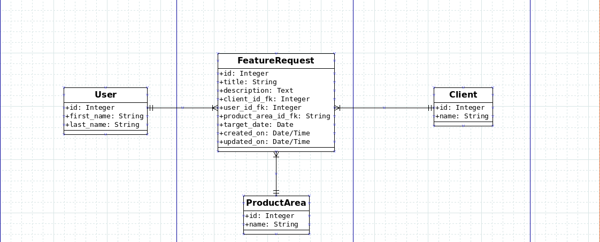

### This Project is Docker Included

To run docker please check that docker & docker-compose is installed in your machine

Visit [https://docs.docker.com/compose/install/](https://docs.docker.com/compose/install/) in your browser.

### Installing Dependencies:

```
pip install -r requirements.txt
```
### Entity relationship Diagram:

ERD-Diagram:



### Setting up the App:

To run the app, first run the `create_db` file directly to create the database tables:

```
$ cd web
```

```
$ python app.py create_db
```

Then run the init_db to inject fixtures json files directly into the database:

```
$ python app.py init_db
```

### For pep8 checking:

To install autopep8:

```
$ pip install autopep8==0.8
```

run the following command as the example below ending with .py,
then copy & paste the code to check if there where changes:

```
$ autopep8 models.py
```
### Running the app:
To run the app itself:

```
$ cd web
```

```
$ python app.py runserver
```

Visit [http://localhost:5000/](http://localhost:5000/) in your browser to see the results.

### Running the app in Docker:
To run the app using Docker:

```
$ sudo docker-compose build
```
After the build is complete run the following command:

```
$ sudo docker-compose up
```

Visit [http://localhost:5000/](http://localhost:5000/) in your browser to see the results.


### Running the tests:

To run the Database test:

```
$ python test_base.py
```

To run the api test make sure to run the app.py first:

```
$ python test_api.py
```

To run the server test make sure to run the app.py first:

```
$ python test_server.py
```

### Checking the demo:
To access the demo please visit the link below:

Visit [https://powerful-tundra-22542.herokuapp.com/](https://powerful-tundra-22542.herokuapp.com/) in your browser.
